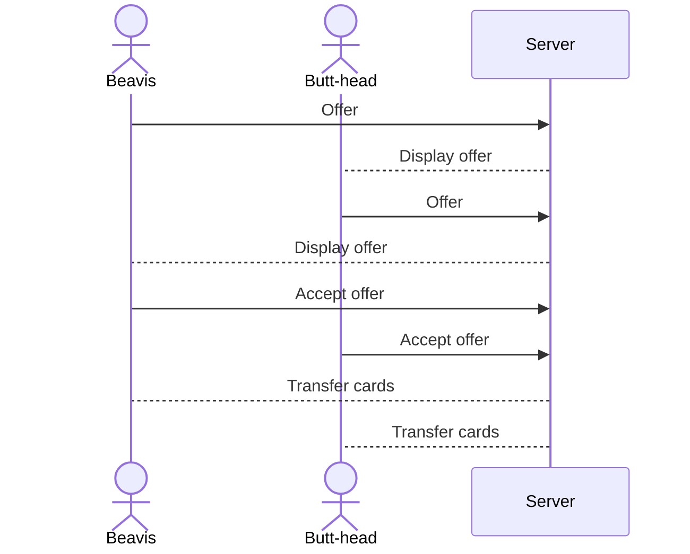

# Fjord

A web application that simulates the collecting and trading aspect of a trading card game. A database of cards will be kept with different rarity levels. Users can design and submit new cards and open packs as a reward. The packs contain randomly selected cards that will appear with different frequencies based on their rarity value. These cards are added to the user's deck and given a "value" based on the actual quantity of that card that exist in the decks of all users. That value will update each time a pack is opened. Users can also trade cards with each other.

## 🚀 Specification Deliverable

For this deliverable I did the following. I checked the box `[x]` and added a description for things I completed.

- `[x]` Proper use of Markdown
- `[x]` A concise and compelling elevator pitch
- `[x]` Description of key features
- `[x]` Description of how you will use each technology
- `[x]` One or more rough sketches of your application. Images must be embedded in this file using Markdown image references.

### Elevator pitch

The best part of any trading card game is collecting and trading the cards. This application simulates the experience of opening packs of cards and trading them with your friends. Users can also participate in the design process by creating their own cards, enabling them to open more packs. Each card has a rarity level that will affect its value based on how many of each card actually exist in each user's deck.

### Design

Above is a mockup of the home page. Users will be able to browse cards and play with the card creator without signing in, but viewing others' profiles and submitting card designs to the database will require them to be using an account. Below is a mockup of the trading page, where users can make offers of cards. When both users have finalized their offers they can accept or decline the trade and the cards will be transferred between their decks.

Below is a diagram of how the server would handle a successful trade between users.

### Features

#### Key Features
- Secure login
- Ability to open decks of 10 cards, once per user per day
- Ability to view the decks of other users
- Card designer to crowdsource new cards, reward with an additional pack to open per card submitted
- Trading functionality, where users can make offers of one or more cards to trade directly with others
- Backend economy that keeps track of the quantity of each card in each user's deck and assigns each card a dollar value based on rarity

#### Stretch Goals
- Value multipliers (holographic cards, etc.)
- Users can choose their favorite cards to feature on their public profiles
- User wallets and a "bank" that buys cards at slightly beneath market value and sells them at slightly above
- Displaying the net value of a user's deck
- A playable game

### Technologies

I am going to use the required technologies in the following ways.

- **HTML** - At least 4 HTML pages (Login page, trading page, browsing page, card design page)
- **CSS** - App styling to make features accessible on desktop and mobile
- **React** - Login, trade functionality, card designer
- **Service** - Backend service for login, generating new card packs, submitting new card designs
- **DB/Login** - Stores usernames/password, cards with counts/rarities/values
- **WebSocket** - Card values must be updated and visible immediately after each pack is opened, card database can be browsed and users' decks can be viewed

## 🚀 AWS deliverable

For this deliverable I did the following. I checked the box `[x]` and added a description for things I completed.

- [ ] **Server deployed and accessible with custom domain name** - [My server link](https://yourdomainnamehere.click).

## 🚀 HTML deliverable

For this deliverable I did the following. I checked the box `[x]` and added a description for things I completed.

- [ ] **HTML pages** - I did not complete this part of the deliverable.
- [ ] **Proper HTML element usage** - I did not complete this part of the deliverable.
- [ ] **Links** - I did not complete this part of the deliverable.
- [ ] **Text** - I did not complete this part of the deliverable.
- [ ] **3rd party API placeholder** - I did not complete this part of the deliverable.
- [ ] **Images** - I did not complete this part of the deliverable.
- [ ] **Login placeholder** - I did not complete this part of the deliverable.
- [ ] **DB data placeholder** - I did not complete this part of the deliverable.
- [ ] **WebSocket placeholder** - I did not complete this part of the deliverable.

## 🚀 CSS deliverable

For this deliverable I did the following. I checked the box `[x]` and added a description for things I completed.

- [ ] **Visually appealing colors and layout. No overflowing elements.** - I did not complete this part of the deliverable.
- [ ] **Use of a CSS framework** - I did not complete this part of the deliverable.
- [ ] **All visual elements styled using CSS** - I did not complete this part of the deliverable.
- [ ] **Responsive to window resizing using flexbox and/or grid display** - I did not complete this part of the deliverable.
- [ ] **Use of a imported font** - I did not complete this part of the deliverable.
- [ ] **Use of different types of selectors including element, class, ID, and pseudo selectors** - I did not complete this part of the deliverable.

## 🚀 React part 1: Routing deliverable

For this deliverable I did the following. I checked the box `[x]` and added a description for things I completed.

- [ ] **Bundled using Vite** - I did not complete this part of the deliverable.
- [ ] **Components** - I did not complete this part of the deliverable.
- [ ] **Router** - I did not complete this part of the deliverable.

## 🚀 React part 2: Reactivity deliverable

For this deliverable I did the following. I checked the box `[x]` and added a description for things I completed.

- [ ] **All functionality implemented or mocked out** - I did not complete this part of the deliverable.
- [ ] **Hooks** - I did not complete this part of the deliverable.

## 🚀 Service deliverable

For this deliverable I did the following. I checked the box `[x]` and added a description for things I completed.

- [ ] **Node.js/Express HTTP service** - I did not complete this part of the deliverable.
- [ ] **Static middleware for frontend** - I did not complete this part of the deliverable.
- [ ] **Calls to third party endpoints** - I did not complete this part of the deliverable.
- [ ] **Backend service endpoints** - I did not complete this part of the deliverable.
- [ ] **Frontend calls service endpoints** - I did not complete this part of the deliverable.
- [ ] **Supports registration, login, logout, and restricted endpoint** - I did not complete this part of the deliverable.

## 🚀 DB deliverable

For this deliverable I did the following. I checked the box `[x]` and added a description for things I completed.

- [ ] **Stores data in MongoDB** - I did not complete this part of the deliverable.
- [ ] **Stores credentials in MongoDB** - I did not complete this part of the deliverable.

## 🚀 WebSocket deliverable

For this deliverable I did the following. I checked the box `[x]` and added a description for things I completed.

- [ ] **Backend listens for WebSocket connection** - I did not complete this part of the deliverable.
- [ ] **Frontend makes WebSocket connection** - I did not complete this part of the deliverable.
- [ ] **Data sent over WebSocket connection** - I did not complete this part of the deliverable.
- [ ] **WebSocket data displayed** - I did not complete this part of the deliverable.
- [ ] **Application is fully functional** - I did not complete this part of the deliverable.
